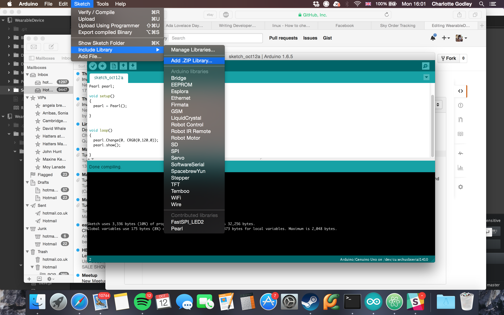
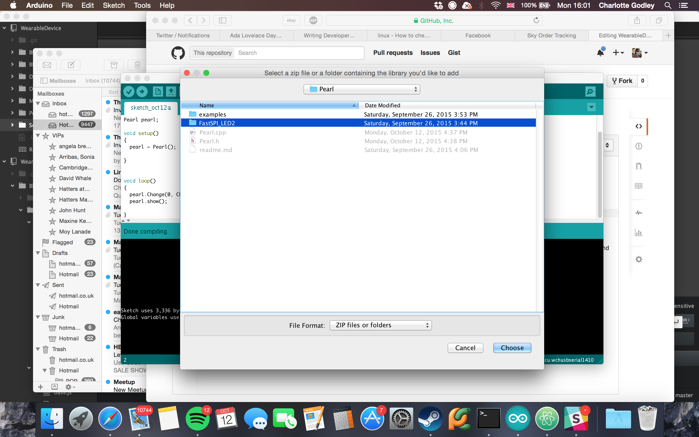

# Pearl board library
The pearl board - the white one with the LEDs on it - has 6 or so lights on it. Each light is individually addressable and can be changed to any colour.
This library provides the ability to change all or each one, turn them all off and update them.
## Installation
To install this library, first install the FastSPI_LED2 library folder through the IDE. To do this, click sketch then libraries:

Navigate to where you downloaded Pearl, then click FastSPI_LED2 and then "choose"

or by copying it into your arduino libs folder. Repeat the process but select the Pearl folder rather than FastSPI_LED2 to install the Pearl library.
## Examples
Provided is one test sketch which you can find in the examples folder - the arduino IDE should also pick this up and put it in the file menu. 
