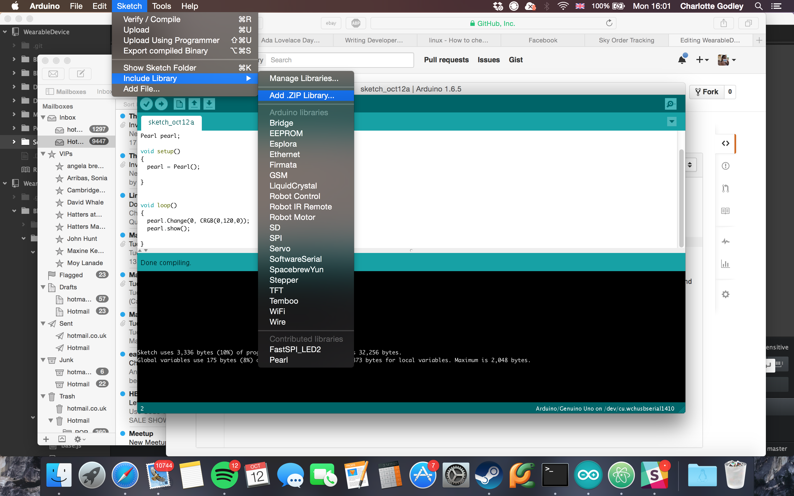
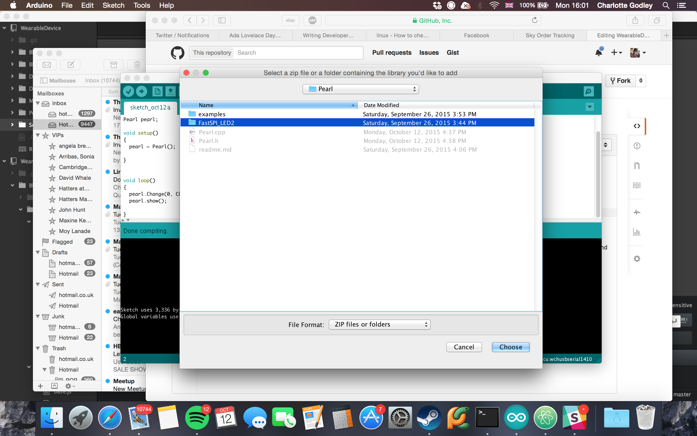

# WearableDevice
This repo contains the libraries created by @godley for the device made by gareth (@4tronix).
Each folder is a different add on board.

## Installation

1. Install the Arduino IDE. You can get that from [here](htttp://arduino.cc)
1. Download this repo as a zip then unzip it, or else clone it.
1. Open the Arduino IDE, click sketch -> import libraries... -> add zip library

1. Locate where you downloaded this repo (path/to/WearableDevice), double click on the library. Single click on one of the sub folders (there should only be one, and it will be the one which isn't named "example") and press "choose":

1. Click sketch -> import libraries... -> add zip library again, this time go to path/to/wearableDevice and single click on the library's folder. Press choose again.
